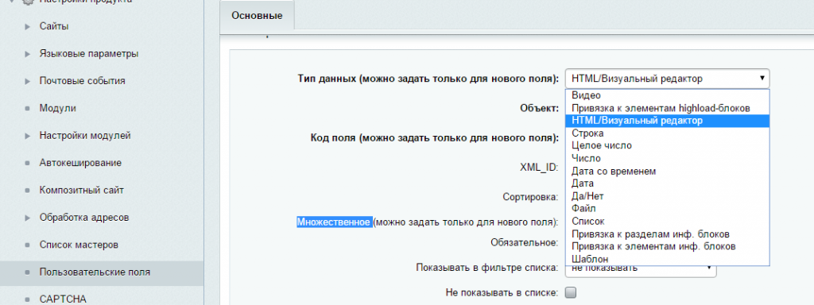
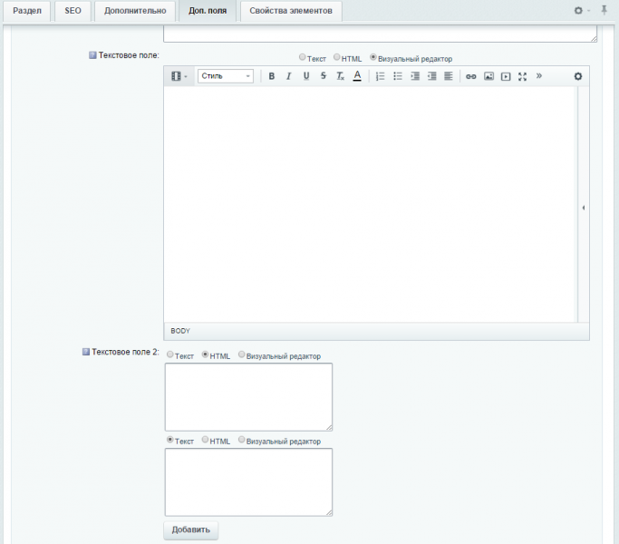

# d2mg.ufhtml

**Описание**

Поддерживается множественность поля!

Модуль расширяет стандартные возможности для редактирования контента в разделах.

После установки решения, появится новый тип пользовательского свойства HTML. Создайте свойство для раздела инфоблока и используйте все возможности визуального редактора.

